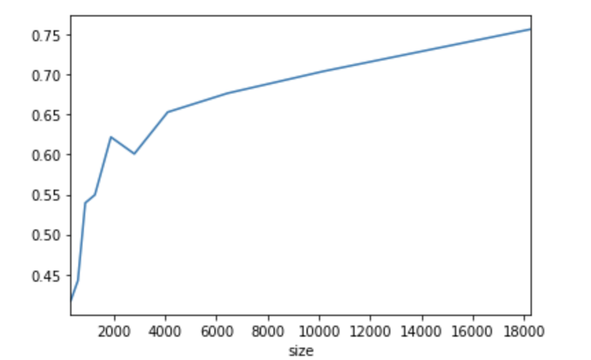
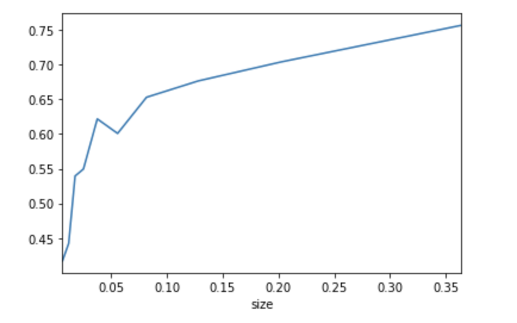
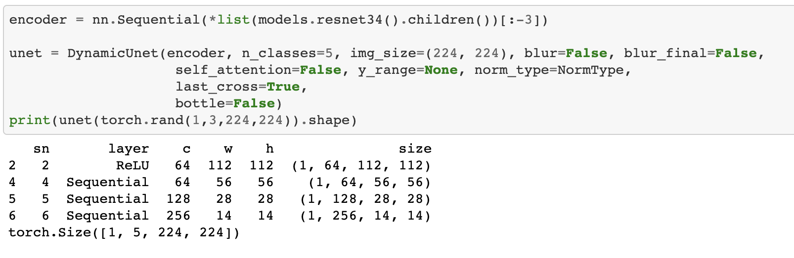
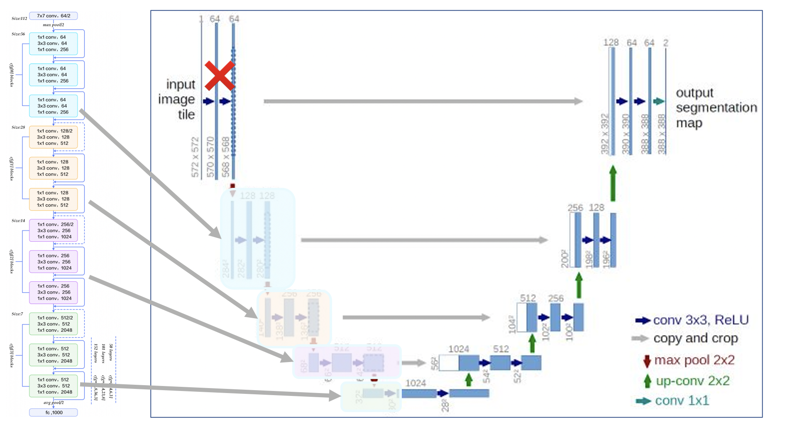

# 使用方式

## 数据准备

原始分类Label是0, 255, 需要简单的预处理为0,1这样对模型有比较好的兼容性


## 训练模型

下面的命令, 默认会尝试不同的Encoder,和不同的参数, 可以根据日志挑选比较合适的参数

```shell
python thyroid/fastai_process.py
```


## 分析结果

* 不同参数/模型的结果

| 模型            | Attention | Epoch | IOU      |
| --------------- | --------- | :---- | -------- |
| densenet201     | True      | 20    | 0.772789 |
| densenet201     | False     | 20    | 0.770076 |
| densenet121     | T         | 20    | 0.774773 |
| densenet121     | F         | 20    | 0.764600 |
| efficientnet-b3 | T         | 20    | 0.769715 |
| efficientnet-b3 | F         | 20    | 0.762074 |


* 不同目标大小的Score [Notebook](https://github.com/Flyfoxs/thyroid_seg/blob/master/notebook/sub_result_analysis.ipynb)

  * 按照Mask像素点的个数统计

  ​			X: 图片Mask像素的个数均值

  ​			Y: IOU的分数的均值



* 按照Mask占比图片面积来统计

​			X: 图片Mask占图片的百分比

​			Y: IOU的分数的均值





# 模型结构

## Original Unet


## Dynamic Unet (Resnet)

The structure of Encoder base on Resnet



默认的Unet是4次下采样, 5成结构, 但是Resnet是只有3次下采样, 所以需要动态的在原始Unet上面去除一层. 具体的网络结构可以参考下图




## Encoder of Dynamic Unet

结构比较规则的网络结构都可以充当Unet的Decoder, 可以参考 [github](https://github.com/Flyfoxs/dynamic_unet)

* densenet
* efficientnet
* wideresnet


# 待验证的点

* 不同类型网络

  这个分割和通常的医疗分割有明显的不同, 暂时只尝试了UNET网络, 试试其他网络应该会有不同效果

  * 人体组织结构在图片的位置不固定
  * 分割对象大小不一致, 比较小的目标分割比较差

* 分割和分类组合训练

  * 预训练Encode分类网络, 然后使用预训练的Encode网络作为backbone
  * 一个网络同时训练分类和分割, 通过加权处理2种loss

* 根据数据分析, 小目标效果比较差, 可以尝试使用FPN或者更换[Cascade相关网络](https://zhuanlan.zhihu.com/p/57629509)

* 其他常用比赛套路: 模型融合和弱监督学习

  

